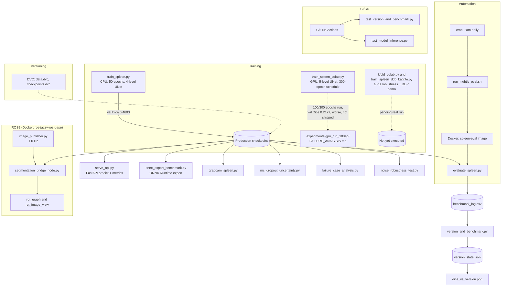
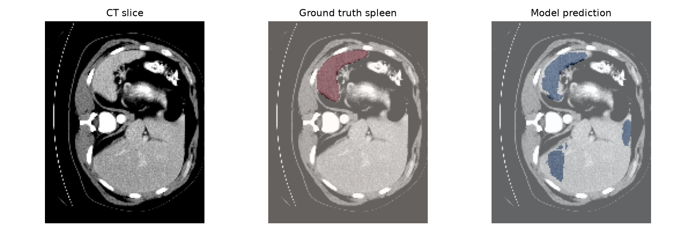
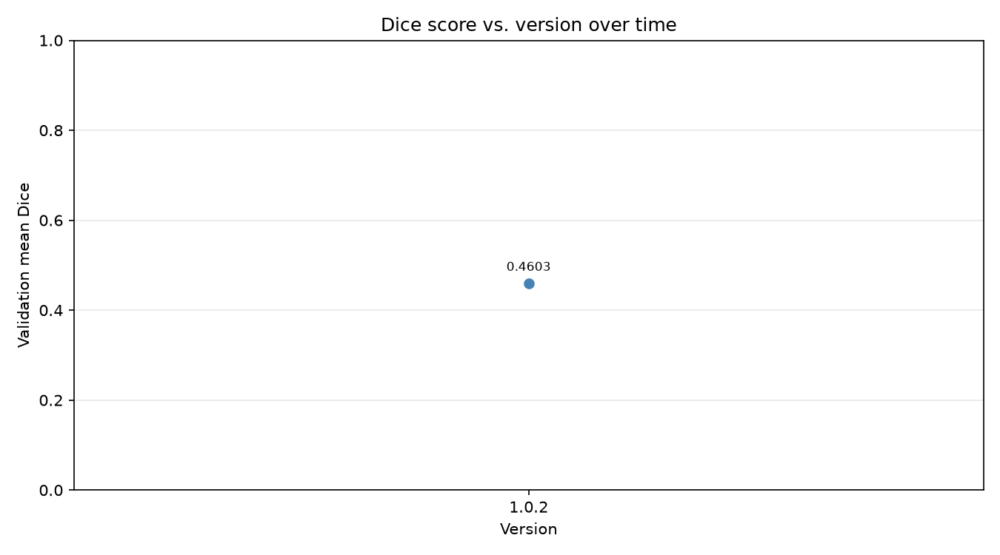

# Spleen Segmentation MLOps Pipeline

[](https://github.com/Adityajaiswal9050/spleen-segmentation-pipeline/actions/workflows/ci.yml)

A solo, hands-on MLOps/robotics-perception project: a 3D U-Net (MONAI) trained
to segment the spleen from abdominal CT, wrapped in the full lifecycle a real
deployment needs — serving, explainability, uncertainty, robustness testing,
versioning, containerization, ROS2 integration, and CI. Built for interview
prep, not a class assignment — every number below is from a real run, not a
projection, including the ones that came out worse than hoped.

## Architecture



## Results — real, measured, not rounded up

| Phase / item | Metric | Result |
|---|---|---|
| Camera calibration (OpenCV) | Reprojection error | **0.4087** (13/14 sample images; 1 corrupted) |
| CPU baseline training (`train_spleen.py`) | Val Dice, 50 epochs | **0.4603** — production checkpoint |
| GPU retrain attempt (`train_spleen_colab.py`) | Val Dice, 100/300 epochs | **0.2127** — worse, not shipped ([why](experiments/gpu_run_100ep/FAILURE_ANALYSIS.md)) |
| Noise robustness (`noise_robustness_test.py`) | Dice @ noise std 0 / 0.05 / 0.10 / 0.20 / 0.30 | 0.4603 / 0.4573 / 0.4496 / 0.3764 / 0.2784 |
| K-fold cross-validation (`kfold_colab.py`) | Mean ± std Dice, 3 folds | **Pending** — script written, not yet run (needs Colab GPU) |
| ONNX export (`onnx_export_benchmark.py`) | Latency, single 64³ patch | PyTorch 316ms vs. ONNX Runtime 68.6ms (**4.61x**), both under the ROS2 node's 1.0Hz budget |
| CI (`test_version_and_benchmark.py` + `test_model_inference.py`) | Tests passing | **8/8**, real inference smoke test included, not just versioning arithmetic |
| Semantic versioning | Current version | `1.0.2` (see `dice_vs_version.png`) |
| Distributed training demo (`train_spleen_ddp_kaggle.py`) | Real 2-GPU DDP run | **Pending** — script written, not yet run (needs Kaggle dual-T4) |
| Cloud deployment | Public endpoint | **Not attempted** — deliberately deferred, not claimed |

The GPU retrain is the most important honest result here: bigger model,
finer spacing, and heavier augmentation *underperformed* the small CPU
baseline because the run was cut off at 100 of a 300-epoch planned LR
schedule. The CPU checkpoint (0.4603) remains what's actually in production.

## Phase-by-phase evidence

**Phase 2 — Camera calibration**
| Detected corners | Undistortion comparison |
|---|---|
|  |  |

Per-image reprojection error: 

**Phase 3 — Segmentation predictions** (`visualize_predictions.py`, CPU baseline checkpoint)


**Phase 4 — ROS2 integration** (`segmentation_bridge_node.py`; runs the real 3D CT model
against the 2D camera feed with a documented input-format caveat — see the
module docstring in that file for why that mismatch is disclosed, not hidden)
| rqt_graph | rqt_image_view |
|---|---|
|  |  |

**Phase 5 — Docker + cron automation**
| `docker ps` | `docker images` | nightly log |
|---|---|---|
|  |  |  |

**Phase 6 — Semantic versioning tied to benchmarks**


**Tier 2 — Grad-CAM explainability**


**Tier 2 — MC dropout uncertainty**


**Tier 2 — Honest failure-case analysis** (worst real Dice cases, not cherry-picked —
see [FAILURE_ANALYSIS.md](FAILURE_ANALYSIS.md) for the full writeup, including a
hypothesis about spleen size that the data itself disproved)


**Tier 2 — Noise robustness**


**Tier 2 — GPU retrain failure analysis**


**Tier 2 — FastAPI serving + monitoring**: `serve_api.py` exposes `/predict`
(real inference + Grad-CAM-style preview), `/health`, and `/metrics`
(request/error/drift counts, latency), plus a drift check on incoming CT
intensity stats against the real training distribution (mean 0.1757,
measured across the 33 training cases, not guessed).

## What's not done, honestly

- **K-fold cross-validation** and the **DDP distributed-training demo** are
  written (`kfold_colab.py`, `train_spleen_ddp_kaggle.py`) but not yet
  executed — both need a GPU this VM doesn't have. Results will be added
  once run on Colab/Kaggle and brought back.
- **Cloud deployment** (Render/Fly.io) was deliberately skipped for now
  rather than rushed — no public endpoint currently exists.
- The **W&B run URL** from the GPU retrain session wasn't preserved, so it
  isn't linked here — the run's real outputs (`training_log.csv`,
  `training_curve.png`) are committed and are what the Dice number above is
  based on.

## Setup

```bash
# clone + create the venv (has MONAI, torch, fastapi, onnxruntime, etc.)
python3 -m venv monai-env && source monai-env/bin/activate
pip install monai torch nibabel fastapi uvicorn python-multipart matplotlib onnxruntime pytest

# pull data/checkpoints (DVC-tracked, not in git)
dvc pull

# run the CPU baseline eval
python evaluate_spleen.py

# run the API
uvicorn serve_api:app --reload
curl http://127.0.0.1:8000/health

# run tests (same as CI)
pytest test_version_and_benchmark.py test_model_inference.py -v
```

## Repo layout

- `train_spleen.py` / `train_spleen_colab.py` / `train_spleen_ddp_kaggle.py` — training (CPU baseline, GPU retrain attempt, distributed demo)
- `evaluate_spleen.py`, `kfold_colab.py`, `noise_robustness_test.py` — evaluation and robustness
- `serve_api.py`, `Dockerfile.api` — serving
- `gradcam_spleen.py`, `mc_dropout_uncertainty.py`, `failure_case_analysis.py` — explainability, uncertainty, honest failure analysis
- `onnx_export_benchmark.py` — export + latency, tied to the ROS2 publish rate
- `version_and_benchmark.py`, `plot_dice_vs_version.py` — semantic versioning gated on real Dice
- `ros2/` — camera publisher, undistortion node, model-serving bridge node
- `calibration/` — OpenCV chessboard calibration
- `.github/workflows/ci.yml` — versioning + real model-inference tests on every push
